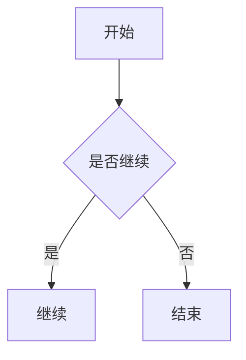

# Vditor_for_Typecho
Enhanced Markdown rendering for Typecho. Features include Mermaid, ECharts, KaTeX, code highlighting, theme switching, and copy/download buttons. Created by Codex.

`Vditor_for_Typecho` 是一个 Typecho 插件，用于替换前台文章页的 Markdown 内容渲染样式，让 Typecho 原生 Markdown 在展示层获得更丰富的能力。

## 功能概览

插件会在前台注入 Vditor 渲染相关资源，并对 Markdown 内容进行增强，主要包括：

- Vditor 内容主题（`light` / `wechat` / `ant-design` / `dark`）
- Mermaid 图表渲染（流程图、时序图等）
- ECharts 图表渲染（`lang-echarts` 代码块）
- KaTeX 数学公式渲染（`$...$` 与 `$$...$$`）
- highlight.js 语法高亮
- 代码块工具栏：语言标识、复制按钮、下载按钮
- 代码块视觉主题预设（Ice / Breeze / Sand / Forest / Midnight / Sunset）

## 环境要求

- Typecho（支持插件机制的版本）
- 文章内容使用 Markdown
- 服务器可访问 CDN（默认使用 `unpkg.com` 拉取前端依赖资源）

## 安装方式

### 方式一：手动下载并解压（推荐）

1. 下载本仓库代码（`Code -> Download ZIP`）。
2. 解压后，确保插件目录名为：`Vditor_for_Typecho`。
3. 将该目录上传到 Typecho 插件目录：
   ```
   /usr/plugins/Vditor_for_Typecho
   ```
   > 也就是最终要保证 `Plugin.php` 位于：`/usr/plugins/Vditor_for_Typecho/Plugin.php`。
4. 登录 Typecho 后台，进入：`控制台 -> 插件`。
5. 找到 **Vditor_for_Typecho**，点击 **启用**。
6. 启用后点击 **设置**，按需调整版本号、主题、代码块风格等参数并保存。

### 方式二：使用 Git 拉取

在你的 Typecho 根目录执行（或在本地后上传）：

```bash
git clone https://github.com/0LIE1/Vditor_for_Typecho.git ./usr/plugins/Vditor_for_Typecho
```

然后在后台插件页启用并配置即可。

## 配置说明

在插件设置页可配置以下内容：

- **Vditor 版本号**：默认 `3.11.2`
- **内容主题**：`light` / `wechat` / `ant-design` / `dark`
- **Mermaid 版本号**：默认 `10.9.1`
- **ECharts 版本号**：默认 `5.5.1`
- **KaTeX 版本号**：默认 `0.16.11`
- **highlight.js 版本号**：默认 `11.11.1`
- **代码块风格**：可视化主题卡片选择

> 建议在生产环境固定版本号，避免 CDN 最新版本升级导致渲染差异。

## 使用示例

### 1) Mermaid

````markdown

````

### 2) ECharts

````markdown
```echarts
{
  "xAxis": {"type": "category", "data": ["Mon", "Tue", "Wed", "Thu", "Fri"]},
  "yAxis": {"type": "value"},
  "series": [{"type": "line", "data": [120, 200, 150, 80, 70]}]
}
```
````

### 3) 数学公式

```markdown
行内公式：$E=mc^2$

块级公式：
$$
\int_0^1 x^2\,dx = \frac{1}{3}
$$
```

## 注意事项

- 插件只在**前台**生效，不影响后台编辑界面。
- 插件仅对 Markdown 文章内容进行包装渲染。
- 若站点无法访问 `unpkg.com`，可能导致样式或图表不显示。
- 如果主题中已对 Markdown 做了大量自定义样式，可能需要进一步微调 CSS。

## 许可证

本项目基于 `MIT License` 开源。

## 🌟 项目灵感与致敬

本插件基于以下优秀的开源项目和作者的灵感开发：

* 🎨 **博客美化方案**：[代码块美化示例](https://ygria.site/prettier-codeblock-demo/) —— 感谢 *Ygria* 提供的交互灵感。
* 🚀 **Arya 编辑器**：[Arya 在线编辑器](https://markdown.lovejade.cn/) —— 感谢 *Lovejade* 提供的功能架构参考。
* ♏ **核心引擎**：[Vditor](https://github.com/Vanessa219/vditor) —— 感谢 *Vanessa219* 开发的这款跨平台 Markdown 编辑器。
