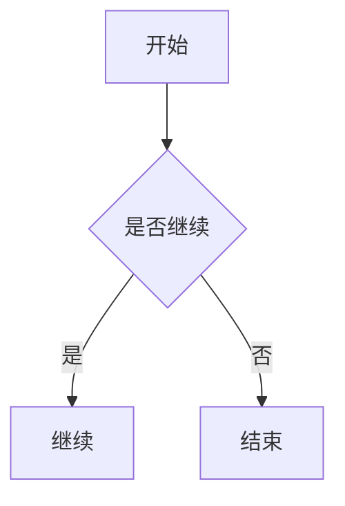
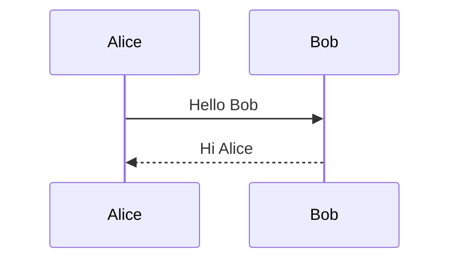
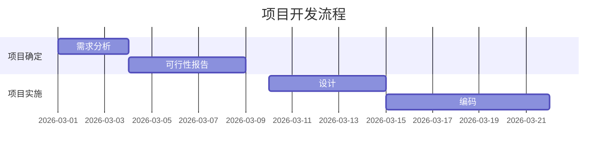

# Vditor_for_Typecho

A Typecho plugin that enhances frontend Markdown presentation with richer rendering and polished code blocks.  
Supports Mermaid, ECharts, KaTeX, syntax highlighting, code block theme switching, and copy/download actions.  
Created by Codex.

`Vditor_for_Typecho` 是一个面向 Typecho 的前台渲染增强插件。  
它不会接管后台编辑器，而是保留 Typecho 原有的 PHP Markdown 渲染流程，在前台文章页为 Markdown 内容补充更完整的展示能力和更现代的视觉样式。

## 功能概览

插件当前提供的能力包括：

- 替换 Typecho 前台文章页的 Markdown 展示样式
- Vditor 内容主题支持：
  - `light`
  - `wechat`
  - `ant-design`
  - `dark`
- Mermaid 图表渲染：
  - 流程图
  - 时序图
  - 甘特图
  - 其他 Mermaid 支持的常见图表
- ECharts 图表渲染：
  - 通过 ```` ```echarts ```` 代码块渲染图表
- KaTeX 数学公式渲染：
  - 行内公式 `$...$`
  - 块级公式 `$$...$$`
- highlight.js 代码高亮
- 代码块增强工具栏：
  - 语言标签
  - 复制按钮
  - 下载按钮
- 代码块主题风格切换
- 后台代码块主题预览与切换

## 设计思路

本插件保持 Typecho 原有内容架构不变：

- Markdown 仍由 Typecho 在服务端进行基础渲染
- 插件只增强前台展示层
- 不替换后台写作界面
- 不强制改变现有主题的文章存储方式

这意味着它更适合用于：

- 已经在使用 Typecho Markdown 写作的站点
- 希望增强文章页表现力，但不想重做后台编辑器的项目
- 需要兼顾公式、图表、代码高亮与代码块美化的内容型网站

## 环境要求

- Typecho
- 文章内容使用 Markdown
- 前台可以访问 CDN 资源
  - 当前默认从 `unpkg.com` 加载前端依赖

## 安装方式

### 手动安装

1. 确保插件目录名为：

   ```text
   Vditor_for_Typecho
   ```

2. 将插件放入 Typecho 插件目录：

   ```text
   /usr/plugins/Vditor_for_Typecho
   ```

3. 确保主文件存在：

   ```text
   /usr/plugins/Vditor_for_Typecho/Plugin.php
   ```

4. 登录 Typecho 后台，进入：

   ```text
   控制台 -> 插件
   ```

5. 启用 `Vditor_for_Typecho`
6. 启用后进入设置页，根据需要调整主题与版本配置

### Git 安装

```bash
git clone https://github.com/0LIE1/Vditor_for_Typecho.git ./usr/plugins/Vditor_for_Typecho
```

然后到 Typecho 后台启用插件即可。

## 配置项

插件后台目前支持以下配置：

- **Vditor 版本号**
- **内容主题**
- **Mermaid 版本号**
- **ECharts 版本号**
- **KaTeX 版本号**
- **highlight.js 版本号**
- **代码块风格预设**

当前内置代码块风格包括：

- Ice
- Breeze
- Sand
- Forest
- Midnight
- Sunset

并提供后台预览卡片，方便直接切换。

## 使用示例

### Mermaid 流程图

````markdown

````

### Mermaid 时序图

````markdown

````

### Mermaid 甘特图

````markdown

````

### ECharts 图表

````markdown
```echarts
{
  "xAxis": {"type": "category", "data": ["Mon", "Tue", "Wed", "Thu", "Fri"]},
  "yAxis": {"type": "value"},
  "series": [{"type": "bar", "data": [120, 200, 150, 80, 70]}]
}
```
````

### 数学公式

```markdown
行内公式：$E=mc^2$

块级公式：

$$
\int_0^1 x^2 dx = \frac{1}{3}
$$
```

### 普通代码块

````markdown
```js
const sum = (a, b) => a + b;
console.log(sum(1, 2));
```
````

前台会自动附加：

- 语言标签
- 复制按钮
- 下载按钮
- 主题化代码块外观

## 注意事项

- 插件主要面向**前台文章页 Markdown 展示**
- 不替换 Typecho 后台 Markdown 编辑器
- 图表与样式资源当前默认通过 CDN 加载
- 若站点无法访问 `unpkg.com`，可能导致：
  - 图表不显示
  - 公式不显示
  - 代码高亮失效
- 如果主题本身对文章内容样式改动较多，可能需要少量 CSS 微调
- 宽图表（如甘特图）会优先保证内容完整，并允许横向滚动展示

## 适用场景

`Vditor_for_Typecho` 适合以下类型站点：

- 技术博客
- 文档站
- 知识库
- 教程类内容网站
- 需要展示流程图、时序图、公式、代码片段的内容型博客

## 项目地址

- GitHub: [https://github.com/0LIE1/Vditor_for_Typecho](https://github.com/0LIE1/Vditor_for_Typecho)

## 致谢

本插件的实现参考和受益于以下优秀项目与灵感来源：

- [Vditor](https://github.com/Vanessa219/vditor)
- [ECharts](https://echarts.apache.org/)
- [KaTeX](https://katex.org/)
- [highlight.js](https://highlightjs.org/)
- [代码块风格灵感示例](https://ygria.site/prettier-codeblock-demo/)
- [Arya 在线编辑器](https://markdown.lovejade.cn/)

## 作者

- Codex

## 🌟效果展示


## 沟通交流


